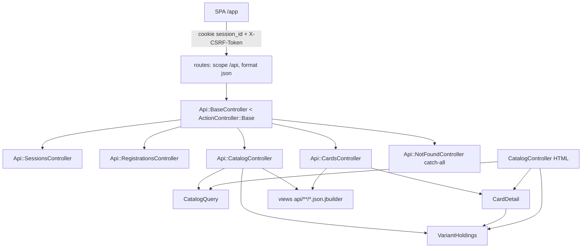

# api-fundacao Design

**Spec**: `.specs/features/api-fundacao/spec.md`
**Status**: Approved (dono, 2026-10-10)

Conforma AD-023 (SPA na mesma origem, `/api` sem versão, `ActionController::Base`),
AD-024 (`jbuilder`, carta ≠ variante, `null` ≠ `0`, dinheiro em string) e AD-021
(o detalhe e a grade não ganham consulta por variante). Nenhuma AD é superada.

---

## Architecture Overview

Um namespace `Api::` com controller base próprio, irmão do `ApplicationController`
e não filho dele. O base concentra o contrato inteiro (sessão resolvida, CSRF,
`401`, envelope de erro, `406`, JSON forçado). As actions só montam dados e
entregam a views `jbuilder`. A lógica do detalhe da carta e da posse por variante
sai do `CatalogController` para dois objetos que os dois lados usam.



---

## Approaches considered (reuso do detalhe)

| | Abordagem | Trade-off |
|---|---|---|
| **A (recomendada)** | Extrair `CardDetail` (variantes listadas, ausentes retidas, destaque) e `VariantHoldings` (posse e meta por variante, uma consulta cada) para objetos puros; `CatalogController` e `Api::*` os usam | Mexe no controller HTML, mas a suíte existente o cobre (API-17) e a regra passa a ter dono único |
| B | Concern `CardDetailing` incluído nos dois controllers | O estado continua em ivars de controller, a armadilha do `authenticated?` continua espalhada, e testar exige request |
| C | API herda de `CatalogController` ou copia os métodos | Duplicação ou acoplamento HTML↔API; contraria o "sem duplicar" do handoff |

---

## Code Reuse Analysis

### Existing Components to Leverage

| Component | Location | How to Use |
|---|---|---|
| `Authentication` | `app/controllers/concerns/authentication.rb` | Incluído no base; `request_authentication` sobrescrito para `401` JSON. `start_new_session_for` e `terminate_session` usados como estão |
| `CatalogQuery` | `app/queries/catalog_query.rb` | Lista e `filter_options` sem alteração; `Result` já traz `page`, `per_page` (com teto), `total_count`, `total_pages`, `active_filters` |
| `CardVariant.present` / `#priced?` | `app/models/card_variant.rb` | Escopo das variantes da lista; `priced?` decide `price: null` |
| `CollectionItem.for_user` / `WishlistItem.for_user` | models | Único caminho para posse e meta; `for_user(nil)` é `none` |
| `User.authenticate_by` | `app/models/user.rb` | Login; `normalizes :email` já cobre caixa |
| `card_image_path` | `config/routes.rb` (`card_images/:variant_code`) | `image_url` da variante (API-30); a constraint `[^/]+` aceita `:` |
| Proteção CSRF do Rails | `ActionController::Base` (`load_defaults 8.0`) | Lê `X-CSRF-Token` nativamente; `request.reset_session` já zera o token (actionpack-8.0.5.1 `action_dispatch/http/request.rb:383`), então login e logout entregam token novo sem código extra (API-09) |

### Integration Points

| System | Integration Method |
|---|---|
| Sessão HTML | Mesmo cookie assinado `session_id` e mesma sessão do Rails: logar pela API loga o HTML e vice-versa |
| Rotas | Bloco `scope "api", module: "api", as: "api", defaults: { format: :json }, format: false` antes do `root`; catch-all `match "*path", via: :all` por último dentro do bloco |
| i18n | `config/locales/pt-BR.yml` novo; `default_locale` continua `en`; só o base da API troca o locale |

---

## Components

### `Api::BaseController`

- **Purpose**: Dono do contrato de acesso e de erro de toda a `/api`.
- **Location**: `app/controllers/api/base_controller.rb`
- **Interfaces**:
  - `include Authentication`; `before_action :resume_session` — resolve a sessão em **toda** action, inclusive nas públicas, e elimina por construção o defeito silencioso do `Current.user` nil descrito no `CLAUDE.md`
  - `around_action :use_api_locale` → `I18n.with_locale(:"pt-BR") { yield }`
  - `allow_browser versions: :modern, block: -> { render_error(:not_acceptable, "unsupported_browser", ...) }` (API-15; assinatura com `block:` conferida em actionpack-8.0.5.1 `metal/allow_browser.rb`)
  - `request_authentication` sobrescrito → `render_error(:unauthorized, "unauthenticated", "Faça login para continuar.")`, sem tocar em `session` (API-10)
  - `rescue_from StandardError`, declarado primeiro para ficar com a menor precedência → `Rails.error.report(e)` + `500 internal_error` (API-16)
  - `rescue_from ActionController::InvalidAuthenticityToken` → `422 invalid_csrf_token` (API-08)
  - `rescue_from ActiveRecord::RecordNotFound` → `404 not_found` (API-12)
  - `rescue_from ActionDispatch::Http::Parameters::ParseError` → `400 invalid_json` "Requisição inválida." (edge case do spec)
  - `render_error(status, code, message, fields = {})` → `render json: { error: { code:, message:, fields: } }, status:` (API-11)
  - helper `csrf_token` → `form_authenticity_token`
- **Dependencies**: `Authentication`, `pt-BR.yml`
- **Reuses**: o concern inteiro e o `allow_browser` do Rails

O erro é montado em Ruby, não em `jbuilder`: o handler de `500` não pode depender
de renderizar template, e o envelope é fixo. Decisão local da feature.

### `Api::SessionsController`

- **Purpose**: Sessão em JSON (API-01..05, 08, 09).
- **Location**: `app/controllers/api/sessions_controller.rb`
- **Interfaces**:
  - `allow_unauthenticated_access only: %i[show create]`
  - `show` → `200` `{ data: { user, csrf_token } }`
  - `create` → `User.authenticate_by(email: params[:email].to_s, password: params[:password].to_s)`; sucesso: `start_new_session_for` → `200`; falha, inclusive campo ausente: `401 invalid_credentials` "E-mail ou senha inválidos."
  - `destroy` → `terminate_session` → `200` com `user: null` e token novo; sem sessão, cai no `401` do base
- **Reuses**: `start_new_session_for`, `terminate_session`. `return_to_after_authenticating` é ignorado, porque a SPA navega sozinha

`.to_s` nos dois campos porque `authenticate_by` com `password: nil` levanta
`ArgumentError`, e o edge case pede `401`.

### `Api::RegistrationsController`

- **Purpose**: Cadastro em JSON (API-06, 07).
- **Location**: `app/controllers/api/registrations_controller.rb`
- **Interfaces**:
  - `allow_unauthenticated_access`
  - `create` → `User.new(registration_params)`; sucesso: `start_new_session_for` → `201`; falha: `422 validation_failed`, `fields: user.errors.to_hash` (mensagens sem o nome do atributo, já em pt-BR pelo locale)
  - `registration_params` → `params[:user].permit(...)` só se for `ActionController::Parameters`, senão `{}`; nunca `params.expect`, que responde `400` (edge case)

### `Api::CatalogController`

- **Purpose**: Lista e opções de filtro (API-18..22, 26).
- **Location**: `app/controllers/api/catalog_controller.rb`
- **Interfaces**:
  - `allow_unauthenticated_access`
  - `index` → `CatalogQuery.new(params, Current.user).call`; `Card.preload_present_variants(result.records)`; `VariantHoldings.new(Current.user, variants)`; render `index.json.jbuilder`
  - `filters` → `CatalogQuery.filter_options` em `filters.json.jbuilder`
- **Reuses**: `CatalogQuery` intacto; um `user_id` em `params` não chega a lugar nenhum porque o usuário vai por argumento (API-20)

### `Api::CardsController`

- **Purpose**: Detalhe (API-23..25).
- **Location**: `app/controllers/api/cards_controller.rb`
- **Interfaces**: `allow_unauthenticated_access`; `show` → `CardDetail.new(card_number: params[:card_number], user: Current.user, requested_variant: params[:variant]).call`
- **Reuses**: `CardDetail`, `VariantHoldings`

### `Api::NotFoundController`

- **Purpose**: `404 not_found` JSON para qualquer caminho sem rota sob `/api` (API-13).
- **Location**: `app/controllers/api/not_found_controller.rb`
- **Interfaces**: `allow_unauthenticated_access`; `skip_forgery_protection`, porque a action não muda estado e, sem isso, um `POST` desconhecido daria `422` antes do `404`; `show` → `render_error(:not_found, ...)`

### `CardDetail` (extraído)

- **Purpose**: Regras do detalhe: variantes listadas (SRC-16/17), ausentes retidas pelo usuário, destaque (CNF-42) e `404` de carta toda oculta.
- **Location**: `app/queries/card_detail.rb`
- **Interfaces**:
  - `CardDetail.new(card_number:, user:, requested_variant:).call → self` (levanta `RecordNotFound`)
  - `#card`, `#variants` (ordenadas por `variant_code`), `#absent_variant_ids` (Set), `#featured_variant`, `#holdings` (`VariantHoldings`)
- **Dependencies**: `Card`, `CardVariant.present`, `CollectionItem`/`WishlistItem.for_user`
- **Reuses**: o corpo atual de `CatalogController#show`, `#hero_variant` e `#held_variant_ids`, movido sem mudar consultas

`CatalogController#show` passa a chamar `authenticated?`, construir o `CardDetail`
e copiar para os ivars que a view já lê (`@card`, `@variants`,
`@absent_variant_ids`, `@hero`, `@owned_quantities`, `@wishlist_targets`). A view
HTML não muda. O `authenticated?` fica uma vez só, no topo, antes de qualquer
leitura de `Current.user`; o comentário de "redundância proposital" deixa de se
aplicar porque o usuário passa por argumento.

### `VariantHoldings` (extraído)

- **Purpose**: Posse e meta do usuário para um conjunto de variantes, uma consulta cada.
- **Location**: `app/queries/variant_holdings.rb`
- **Interfaces**:
  - `VariantHoldings.new(user, variants)`
  - `#owned_quantities → Hash{id=>qty}`, `#wishlist_targets → Hash{id=>target}`, no formato que a view HTML já usa
  - `#owned_quantity(variant) → Integer | nil`: `nil` sem usuário, `0` sem item (API-31)
  - `#wishlist_target(variant) → Integer | nil`: `nil` sem usuário ou sem item
- **Reuses**: os `#owned_quantities` e `#wishlist_targets` atuais do `CatalogController`; o `CatalogController#index` passa a usá-lo também

### `Card.preload_present_variants(cards)`

- **Purpose**: As linhas do `Preloader` com `scope: CardVariant.present`, hoje em `CatalogController#index`, num lugar só (lista HTML e API).
- **Location**: `app/models/card.rb`

### Views `jbuilder`

- **Location**: `app/views/api/`
  - `cards/_card.json.jbuilder`: campos da carta (API-27/28); `attributes` lê `attributes_list`; `set` → `{ code, name }`
  - `cards/_variant.json.jbuilder`: campos da variante; `image_url` = `card_image_path(variant.variant_code)`; `price` via `_price`; `in_source`; `owned_quantity` e `wishlist_target` de `holdings`
  - `cards/_price.json.jbuilder`: `null` se `!priced?`; senão `amount` em string com duas casas (`"1.70"`, `"0.00"`), `currency`, `observed_at` em ISO 8601 UTC
  - `catalog/index.json.jbuilder`: `data` (cartas com variantes) e `meta`
  - `catalog/filters.json.jbuilder` e `cards/show.json.jbuilder` (`data`: carta, variantes e `featured_variant_code`)
  - `sessions/_session.json.jbuilder`: `user: { email } | null` e `csrf_token`, usado por sessão e cadastro

`in_source` na lista é sempre `true` (só presentes); no detalhe é
`!absent_variant_ids.include?(id)`. O partial recebe o valor como local.

O `amount` sai de `price_amount.round(2).to_s("F")`, completado para duas casas,
sem passar por Float. O teste fixa `"1.70"` e `"0.00"`.

---

## Data Models

Nenhuma migração. Payload:

```text
Card    { card_number, name, card_type, colors[], cost?, life?, power?, counter?,
          attributes[], traits[], block_icon?, effect_text?, trigger_text?,
          set: { code, name }, variants: Variant[] }
Variant { variant_code, art_kind, rarity?, illustrator?, set: { code, name },
          image_url, price: Price?, in_source, owned_quantity?, wishlist_target? }
Price   { amount: "0.00", currency: "USD", observed_at: "2026-01-01T00:00:00Z" }
List    { data: Card[], meta: { page, per_page, total_count, total_pages, active_filters } }
Detail  { data: Card & { featured_variant_code } }
Session { data: { user: { email } | null, csrf_token } }
Error   { error: { code, message, fields: {} } }
```

`?` indica que o campo pode ser `null`. `meta.active_filters` é o hash
normalizado do `CatalogQuery`.

---

## Error Handling Strategy

| Error Scenario | Handling | User Impact |
|---|---|---|
| Sem sessão em endpoint protegido | `request_authentication` → `401 unauthenticated` | SPA leva ao login |
| Token CSRF ausente ou velho | `InvalidAuthenticityToken` → `422 invalid_csrf_token` | SPA busca `GET /api/session` e repete |
| Credencial errada ou campo ausente | `401 invalid_credentials`, corpo idêntico | Mensagem única |
| Cadastro inválido ou sem `user` | `422 validation_failed` com `fields` em pt-BR | Erro por campo |
| Registro inexistente ou carta oculta | `RecordNotFound` → `404 not_found` | "Não encontrado." |
| Caminho sem rota ou com extensão (`.html`) | catch-all → `404 not_found` JSON | idem |
| Navegador antigo | bloco do `allow_browser` → `406 unsupported_browser` | Aviso |
| JSON malformado no corpo | `ParseError` → `400 invalid_json` | Erro genérico de requisição |
| Exceção não tratada | `Rails.error.report` + `500 internal_error` genérico | "Erro inesperado. Tente novamente."; o detalhe fica só no log |

---

## Risks & Concerns

| Concern | Location (file:line) | Impact | Mitigation |
|---|---|---|---|
| Defeito silencioso: controller público lê `Current.user` antes de `authenticated?` | `app/controllers/catalog_controller.rb:24`; `CLAUDE.md`, dívidas | Posse some com `200` | `before_action :resume_session` no base da API; objetos extraídos recebem `user` por argumento; teste de posse autenticada em cada endpoint público |
| `allow_forgery_protection = false` em teste | `config/environments/test.rb:29` | Teste de CSRF passaria sem exercitar nada | Os testes de CSRF ligam `ActionController::Base.allow_forgery_protection` no `setup` e restauram no `teardown`; um teste prova que sem token dá `422` |
| `rescue_from StandardError` esconde erro de programação nos testes | base controller | Falha vira `500` opaco | `Rails.error.report` + log; o teste do `500` usa uma rota de teste que levanta de propósito |
| JSON malformado não estava no spec | spec, Edge Cases | Sem handler, cairia em `500` | `400 invalid_json` "Requisição inválida."; emenda aprovada pelo dono em 2026-10-10 (edge case do spec e caso de borda do Req. 16) |
| Refactor do `CatalogController` (API-17) | `app/controllers/catalog_controller.rb:15-77` | Regressão no HTML | Task própria, antes da API, com gate full sem editar teste; comportamento e consultas idênticos |
| Login sem rate limit (dívida existente) | `app/controllers/sessions_controller.rb:13` | A API abre um segundo caminho de força bruta, com o mesmo piso de senha | Fora de escopo, como no HTML; registrado no spec |
| `Session` órfã no login de quem já está autenticado (dívida existente, handoff de 2026-10-05) | `app/controllers/concerns/authentication.rb` (`start_new_session_for`) | Registro sobra no banco | Mesmo comportamento do HTML (edge case do spec); não corrigir aqui |
| `pt-BR.yml` incompleto mostra "translation missing" | `config/locales/` | Mensagem quebrada na API | O teste de cadastro inválido afirma a string exata de cada caso (`blank`, `taken`, `too_short`, `confirmation`); o `en` não muda, e `test/models/user_password_test.rb:137` continua em inglês |
| `wrap_parameters` envolve o JSON no nome do controller | `load_defaults 8.0` | `Api::SessionsController` envolve em `session` com os atributos do model `Session` | Inofensivo: as chaves de topo continuam; o cadastro lê `user`, que a SPA manda explicitamente |

---

## Tech Decisions

| Decision | Choice | Rationale |
|---|---|---|
| Base da API | Irmão de `ApplicationController`, não filho | Herdar traria o `allow_browser` do HTML como segundo `before_action` |
| Sessão nas públicas | `before_action :resume_session` no base | Uma consulta indexada por request; remove a classe de defeito do `Current.user` nil |
| Mensagens pt-BR | `pt-BR.yml` mínimo + `I18n.with_locale` só na API | Mecanismo nativo; HTML e testes de model seguem em `en` |
| JSON forçado | `defaults: { format: :json }` + `format: false` no scope | `params[:format]` vence o `Accept`; sem extensão no caminho, `.html` cai no catch-all |
| Erro fora do `jbuilder` | `render json:` no base | O `500` não pode depender de template |
| Extração | `CardDetail` e `VariantHoldings` em `app/queries/` | Dono único da regra; o padrão de query object já existe (`SetProgressQuery`, `DeckShortfallQuery`) |
