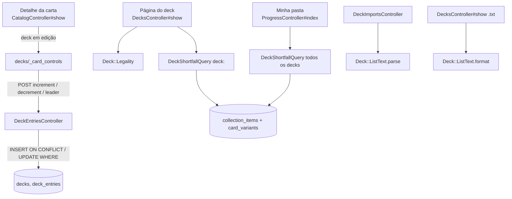

# Decks — Design

**Spec**: `.specs/features/decks/spec.md` (DCK-01..44, Req. 14)
**Status**: Approved (dono, 2026-10-02: deck em edição na sessão)

---

## Architecture Overview

O deck é a terceira coisa que o usuário escreve, depois da coleção e da
wishlist, e segue as mesmas invariantes: o dono vem da sessão, nada cascateia a
partir do catálogo e as operações de quantidade são atômicas no SQL. O que muda
é o alvo: o deck referencia `cards`, enquanto coleção e wishlist referenciam
`card_variants` (`.context/design.md` §3.1, §10).

A lógica fica em quatro peças, e nenhuma delas conhece HTTP:

- **`Deck::Legality`**: função pura que recebe Leader e entradas e devolve
  status, motivos e avisos (DCK-11..16, DCK-42..44). Não lê o banco nem grava nada.
- **`DeckShortfallQuery`**: uma consulta que cruza os decks com a coleção. Ela
  responde "o que falta" para um deck (DCK-21, DCK-22) e para todos os decks do
  usuário (DCK-33). A pergunta é a mesma, só muda o escopo, então a consulta é
  uma só.
- **`Deck::ListText`**: `parse` e `format` do formato do OPTCG Simulator
  (DCK-25..29, DCK-31, DCK-32). Também é pura. Quem decide o que vira deck é o
  controller de importação.
- **Deck em edição**: guardado na sessão do Rails, não em URL nem em coluna
  (ver *Tech Decisions*).



---

## Code Reuse Analysis

### Existing Components to Leverage

| Component | Location | How to Use |
|---|---|---|
| Incremento atômico com `INSERT ... ON CONFLICT DO UPDATE` e piso no `WHERE` | `app/controllers/collection_items_controller.rb:40-88` | Mesmo padrão em `deck_entries`, com o teto de 50 no `WHERE` do `DO UPDATE` (DCK-38, DCK-39) |
| `execute_returning_quantity` com bind params | `app/controllers/collection_items_controller.rb:97-103` | Mesma forma. Nunca interpolar id vindo do request |
| Resposta dupla: HTML (`redirect_back`) e Turbo Stream (`turbo_stream.update`) | `CollectionItemsController#respond_with_quantity` | Controle do deck no detalhe (DCK-05) |
| `dom_id(record, :prefixo)` como alvo do Stream | `app/views/collection_items/_ownership.html.erb` | `dom_id(card, :deck_entry)` |
| Sessão obrigatória por padrão (`Authentication`) | `app/controllers/concerns/authentication.rb` | Os controllers de deck não declaram nada (DCK-37) |
| `authenticated?` antes de ler `Current.user` em controller público | `CatalogController#owned_quantities` | O detalhe só procura o deck em edição depois de `authenticated?` |
| `CardVariant::PRESENT_SQL` | `app/models/card_variant.rb:15` | Uma carta está "fora da fonte" quando nenhuma variante dela está presente (DCK-19) |
| Estilo de query object (`User` como objeto, `nil` devolve vazio, uma agregação só) | `app/queries/set_progress_query.rb` | `DeckShortfallQuery` |
| Confirmação explícita em página própria, sem JS | `app/views/collection_imports/show.html.erb` | Exclusão do deck (DCK-09) |
| Coluna lateral da pasta (`progress__secondary`, 420px a partir de 1024px) | `app/views/progress/index.html.erb:146` | Bloco "Faltando para os baralhos" no topo da coluna, como no canvas (`navegacao/canvas/Desktop-Pasta.dc.html:126`) |
| `nav_link_to` | `app/views/layouts/application.html.erb:26-43` | Entrada "Baralhos" entre "Minha pasta" e "Sair", como em todos os artboards do canvas |

### Integration Points

| System | Integration Method |
|---|---|
| Catálogo (`cards`) | FKs `deck_entries.card_id` e `decks.leader_card_id` com `ON DELETE RESTRICT`. A ingestão não apaga nada, e o restrict é a segunda trava |
| Coleção (`collection_items`) | Só leitura, pela `DeckShortfallQuery`. Não há escrita cruzada, e excluir um deck não toca a coleção (DCK-09) |
| Detalhe da carta | Partial `decks/_card_controls` em `catalog/show.html.erb`, quando há deck em edição |
| Minha pasta | Partial `decks/_shortfall` em `progress/index.html.erb` |
| Navegação | Link "Baralhos" no layout, só com sessão |

---

## Components

### `Deck` (model)

- **Purpose**: o deck de um usuário, com nome, Leader opcional e entradas.
- **Location**: `app/models/deck.rb`
- **Interfaces**:
  - `belongs_to :user`, `belongs_to :leader, class_name: "Card", optional: true`
  - `has_many :entries, class_name: "DeckEntry", dependent: :delete_all`
  - `normalizes :name, with: :strip`, `validates :name, length: { in: 1..60 }`
  - validação de que `leader` tem `card_type == "leader"`. É integridade do modelo, não regra de jogo (ver *Error Handling*)
  - `ordered_entries → [DeckEntry]`: character, event e stage, depois `cost` com nulos por último, depois `card_number` (DCK-07, DCK-31)
  - `main_total → Integer`, `legality → Deck::Legality::Result`
- **Reuses**: o padrão `User has_many ..., dependent: :restrict_with_exception`.

### `DeckEntry` (model)

- **Purpose**: `(deck, carta, quantidade)` do deck principal.
- **Location**: `app/models/deck_entry.rb`
- **Interfaces**: `belongs_to :deck`, `belongs_to :card`; `quantity` inteira de 1 a 50; validação de que `card` não é Leader.

### `Deck::Legality`

- **Purpose**: status `valid | incomplete | invalid`, motivos e avisos em português (DCK-11..16, DCK-42..44).
- **Location**: `app/models/deck/legality.rb`
- **Interfaces**: `Deck::Legality.call(leader:, entries:) → Result(status:, reasons:, warnings:)`. `leader` é um `Card` ou `nil`; `entries` é uma lista de pares `[Card, Integer]`.
- **Regras** (Comprehensive Rules 2-3-5 e 5-1-2-2..4, confirmadas na T1): é `invalid` se o total passar de 50, se alguma carta não isenta passar de 4 cópias ou se, havendo Leader, `card.colors - leader.colors` não for vazio para alguma carta. Fora disso, é `valid` se tiver Leader e o total for 50, e `incomplete` nos demais casos. Os motivos de `invalid` e de `incomplete` aparecem juntos: um deck com 51 cartas e sem Leader mostra os dois.
- **Efeitos de carta sobre a montagem (5-1-2-4)**: dois predicados sobre `effect_text`, em `Card`, comparando sem caixa e com espaços normalizados. `Card#unlimited_copies?` casa "Under the rules of this game, you may have any number of this card in your deck" e isenta a carta do limite de 4 (DCK-43), mas não do limite de 50 do banco. `Card#own_deck_rule` devolve a frase do Leader que começa com "Under the rules of this game" e contém "cannot include" ou "can only include", ou `nil`. Quando há frase, ela vira um item de `warnings` e o status não muda (DCK-44, decisão do dono em 2026-10-02). Não há lista mantida à mão: carta nova com a mesma frase entra sozinha na próxima ingestão.
- **Dependencies**: nenhuma. O teste unitário não precisa de banco.

### `DeckShortfallQuery`

- **Purpose**: quantidade pedida, possuída e faltante por carta (DCK-20..23, DCK-33).
- **Location**: `app/queries/deck_shortfall_query.rb`
- **Interfaces**: `DeckShortfallQuery.new(user, deck: nil).call → [Row(card, required, owned, missing, deck_ids)]`. Com `deck:`, considera só aquele deck; sem `deck:`, todos os decks do usuário, e `required` passa a ser o `MAX` entre eles.
- **Forma**: uma consulta só. O CTE `demand` faz o `UNION ALL` das entradas com o Leader (quantidade 1) e agrupa por carta com `MAX(quantity)` e `array_agg(deck_id)`. O CTE `owned` soma `collection_items.quantity` do usuário por `card_variants.card_id`, **sem** filtro de presença (DCK-20). O `LEFT JOIN` entre os dois dá `missing = GREATEST(0, required - COALESCE(owned, 0))`.
- **Reuses**: o estilo da `SetProgressQuery`.

### `Deck::ListText`

- **Purpose**: ler e escrever o formato do OPTCG Simulator.
- **Location**: `app/models/deck/list_text.rb`
- **Interfaces**:
  - `Deck::ListText.parse(text) → Result(leader:, entries:, errors:)`. `entries` é um hash `{Card => Integer}`; `errors` é uma lista de `{line:, message:}`.
    - Recusa antes de processar o texto acima de 200 linhas ou 10.000 caracteres (DCK-29).
    - Separa as linhas por `/\r\n|\r|\n/`, ignora as em branco e casa `/\A\s*(\d+)\s*x\s*([A-Za-z0-9-]+)\s*\z/i` (DCK-25).
    - Busca todos os `card_number` numa consulta só, comparando em caixa alta.
    - Soma linhas repetidas (DCK-27) e faz as verificações de Leader do DCK-28.
  - `Deck::ListText.format(deck) → String`: Leader primeiro, depois `ordered_entries`, unidos por `"\n"` (DCK-31).
- **Dependencies**: `Card`, com uma consulta por `parse`.

### `DecksController`

- **Purpose**: CRUD do deck e escolha do deck em edição.
- **Location**: `app/controllers/decks_controller.rb`
- **Interfaces**: `index`, `new`, `create` (cria e já marca como em edição), `show` (HTML, e `.txt` para exportar), `edit` e `update` (renomear), `delete` (página de confirmação), `destroy`, `select` (`POST /decks/:id/select` marca o deck como em edição).
- **Escopo**: todo acesso passa por `Current.user.decks.find(params[:id])`. Um deck de outro usuário cai em `RecordNotFound` e responde 404 (DCK-36).

### `DeckEntriesController`

- **Purpose**: incremento, decremento e Leader, acionados pelo detalhe da carta.
- **Location**: `app/controllers/deck_entries_controller.rb`
- **Interfaces**:
  - `POST /decks/:deck_id/cards/:card_id/increment` roda `INSERT ... ON CONFLICT (deck_id, card_id) DO UPDATE SET quantity = deck_entries.quantity + 1 WHERE deck_entries.quantity < 50 RETURNING quantity`. Se nenhuma linha voltar, a operação foi recusada e a quantidade continua a mesma (DCK-39).
  - `POST .../decrement` roda `UPDATE ... SET quantity = quantity - 1 WHERE ... AND quantity > 1 RETURNING`. Se nada casar, roda `DELETE ... WHERE ... AND quantity = 1` (DCK-06). Com dois decrementos simultâneos sobre 2, o primeiro baixa para 1 e o segundo apaga a linha, e o resultado final está correto.
  - `POST /decks/:deck_id/leader` com `card_id` grava `leader_card_id`.
- **Reuses**: `CollectionItemsController`: o SQL, os binds e a resposta dupla.

### `DeckImportsController`

- **Purpose**: receber a lista colada e criar um deck novo (DCK-24..30).
- **Location**: `app/controllers/deck_imports_controller.rb`
- **Interfaces**: `new` mostra o formulário com nome opcional e um `<textarea>`. `create`, se houver erro, re-renderiza `new` com 422 e as linhas recusadas, sem criar nada; sem erro, cria o deck e as entradas numa transação e redireciona para o deck.
- **Por que não reusar a staging do import CSV (AD-007)**: a importação de deck só cria, nunca altera algo que já existe. Não há diff para pré-visualizar e confirmar, porque a página do deck criado já mostra status e motivos. A transação garante o tudo-ou-nada.

### Views

- `decks/index`, `decks/show`, `decks/new`, `decks/edit`, `decks/delete` e `deck_imports/new`.
- `decks/_card_controls`: no detalhe, o controle `− N +` para carta que não é Leader, ou "Usar como Leader" para Leader, junto com o nome do deck em edição e um link para ele.
- `decks/_shortfall`: o bloco da pasta (DCK-34, DCK-35).
- Sem Stimulus: o importmap só tem Turbo, de propósito.

---

## Data Models

### `decks`

```sql
CREATE TABLE decks (
  id             bigserial PRIMARY KEY,
  user_id        bigint NOT NULL REFERENCES users ON DELETE RESTRICT,
  name           text   NOT NULL CHECK (char_length(name) BETWEEN 1 AND 60),
  leader_card_id bigint NULL     REFERENCES cards ON DELETE RESTRICT,
  created_at     timestamp(6) NOT NULL,
  updated_at     timestamp(6) NOT NULL
);
CREATE INDEX ON decks (user_id);
CREATE INDEX ON decks (leader_card_id);
```

### `deck_entries`

```sql
CREATE TABLE deck_entries (
  id         bigserial PRIMARY KEY,
  deck_id    bigint  NOT NULL REFERENCES decks ON DELETE CASCADE,
  card_id    bigint  NOT NULL REFERENCES cards ON DELETE RESTRICT,
  quantity   integer NOT NULL CHECK (quantity BETWEEN 1 AND 50),
  created_at timestamp(6) NOT NULL,
  updated_at timestamp(6) NOT NULL
);
CREATE UNIQUE INDEX ON deck_entries (deck_id, card_id);
CREATE INDEX ON deck_entries (card_id);
```

**Relationships**: `User has_many :decks, dependent: :restrict_with_exception`.
`deck_entries.deck_id` é a única cascata do projeto, e é deliberada: apagar o
deck apaga as entradas dele (DCK-09), que não são dado de coleção. **Nenhuma**
FK que parte de `cards` cascateia (DCK-40). Basta uma migração,
`CreateDecks`, seguida de `db:migrate` para regenerar `db/structure.sql`.

A regra de que um Leader não entra nas entradas não vira CHECK: o Postgres não
faz CHECK entre tabelas, e um trigger só para isso custaria mais que a
validação no model somada ao controller que recusa Leader no incremento.

---

## Error Handling Strategy

| Error Scenario | Handling | User Impact |
|---|---|---|
| Deck de outro usuário ou id inexistente | `Current.user.decks.find` → `RecordNotFound` → 404 | Página 404, sem revelar se o deck existe (DCK-36) |
| Sem sessão | `require_authentication` padrão | Redireciona para o login, e nada é aplicado (DCK-37) |
| Incremento acima de 50 | O `WHERE quantity < 50` não casa e o `RETURNING` volta vazio | Alerta "O máximo é 50 cópias por carta no deck"; a quantidade continua a mesma (DCK-39) |
| Carta Leader enviada a `increment`, ou carta comum enviada a `leader` | Recusa com 422 | Alerta em português. É a forma do modelo, não uma regra de jogo, então não fere o DCK-18 |
| Regra de jogo violada (5 cópias, cor, 51 cartas) | Grava; `Deck::Legality` mostra o motivo | Status `inválido` com os motivos (DCK-18) |
| Nome vazio ou com mais de 60 caracteres | Validação no model e CHECK no banco | Formulário re-renderizado com a mensagem (DCK-39) |
| Importação com linha ruim | `parse` devolve `errors` e nada é criado | 422 com "Linha N: motivo" para cada linha (DCK-28) |
| Texto acima do limite | `parse` recusa antes de separar as linhas | 422 informando o limite (DCK-29) |
| Deck em edição excluído, ou de outro usuário, na sessão | `Current.user.decks.find_by(id: session[:editing_deck_id])` devolve `nil`, e a chave sai da sessão | O detalhe deixa de mostrar o controle de deck (DCK-41) |

---

## Risks & Concerns

| Concern | Location (file:line) | Impact | Mitigation |
|---|---|---|---|
| Controller público não resolve a sessão sozinho | `app/controllers/catalog_controller.rb` (`show`) | O controle de deck sumiria em silêncio para quem está logado | `editing_deck` só lê `Current.user` depois de `authenticated?`, como faz `owned_quantities`. Teste de integração do detalhe com e sem sessão |
| `CatalogController#show` já acumula muita coisa (variantes, ausentes, hero, posse, wishlist) | `app/controllers/catalog_controller.rb:48-62` | Mais uma responsabilidade num método cheio | O detalhe ganha só `@editing_deck` e a quantidade da carta nele, numa consulta. A lógica fica no partial e no `DeckEntriesController` |
| Primeiro uso de `session[...]` no projeto | — | Padrão novo | É a sessão de cookie do próprio Rails, já assinada. O valor guardado é só um id, revalidado contra o dono a cada leitura, então adulterá-lo não dá acesso a nada (DCK-36) |
| Restrição de Leader não verificada (OP12-001, OP13-079, P-117) | `Deck::Legality` | O app mostra `válido` para um deck que a restrição do Leader torna ilegal | Decisão do dono: aviso com o texto da regra ao lado do status (DCK-44). A frase vem do catálogo, então o aviso aparece para qualquer Leader novo com regra própria |
| Detecção pela frase do efeito depende da redação da apitcg | `Card#unlimited_copies?`, `Card#own_deck_rule` | Se a fonte mudar a redação, a isenção ou o aviso somem em silêncio | O teste da T4 usa o `effect_text` real das cartas do snapshot, e a T19 (ingestão) verifica que a frase sobrevive ao Normalize |
| Deadlocks pré-existentes em `test/queries` sob execução concorrente | AD-010 | Flake no gate | O teste de concorrência do deck (DCK-38) é o primeiro do projeto: a coleção não tem teste de corrida, só o SQL atômico comentado. Ele roda duas threads, cada uma com conexão própria do pool (`with_connection`), fora da transação do teste (`self.use_transactional_tests = false` no arquivo, limpando o que criou) |
| Sem teto de decks por usuário nem rate limit | `app/controllers/decks_controller.rb` (`create`) | Um usuário autenticado pode criar decks em laço e inchar a lista | Achado LOW da revisão de segurança, aceito como dívida junto com a do rate limit do login (`CLAUDE.md`). Reabrir com Redis ou `solid_cache` |
| Sessão do Rails sobrevive ao logout (`reset_session` ausente) | `app/controllers/concerns/authentication.rb:70-80` | Um id de deck em edição fica no cookie depois do logout | Dívida anterior à feature. A revalidação por `Current.user.decks` neutraliza o id herdado, e há teste disso (T12) |
| `turbo_confirm` depende de JS e não tem teste sem navegador | — | DCK-09 sem prova | Confirmação em página própria (`GET /decks/:id/delete`), testável por integração |

---

## Tech Decisions

| Decision | Choice | Rationale |
|---|---|---|
| Onde mora o deck em edição | `session[:editing_deck_id]` (cookie de sessão do Rails), revalidado por `Current.user.decks.find_by` a cada leitura | O requisito é só que o controle saiba qual é o deck (spec, *Assumptions*). Não exige migração nem propagar parâmetro por todos os links do catálogo, e um deck excluído some sozinho (DCK-41). O custo é que o deck em edição não sobrevive ao logout nem passa de um aparelho para outro. Alternativas abaixo |
| Quem marca o deck em edição | Criar ou importar um deck já o marca, e a página do deck tem "Editar este deck" | O fluxo do Independent Test (criar, abrir o detalhe, usar Leader) funciona sem passo extra |
| Status do deck | Calculado em Ruby por `Deck::Legality` sobre as entradas já carregadas | Um deck tem no máximo 51 linhas. SQL só se pagaria para filtrar decks por status, e isso não foi pedido |
| Lista de decks (DCK-08) | `includes(:leader, entries: :card)` e `Deck::Legality` por deck | Um usuário tem poucos decks, e o *eager load* evita N+1 |
| "Fora da fonte" de uma carta | Nenhuma variante dela satisfaz `CardVariant::PRESENT_SQL` | A presença mora nas variantes (`card_variant.rb:15`), e a carta segue a mesma regra do catálogo |
| Ordem da página e da exportação | `card_type` (character, event, stage), depois `cost NULLS LAST`, depois `card_number` | DCK-07 e DCK-31 pedem a mesma ordem, e `Deck#ordered_entries` serve as duas |
| Exportação | `GET /decks/:id.txt`, `text/plain; charset=utf-8`, exibido no navegador | O usuário copia ou salva o texto, e o LF fica fácil de testar (DCK-31) |
| Importar sem staging | Uma transação, sem pré-visualização | Ver `DeckImportsController`. Não contraria a AD-007, que trata de **substituir** posse |

### Alternativas para o deck em edição (escolha do dono)

| Opção | Ganha | Perde |
|---|---|---|
| **Sessão do Rails** (recomendada) | Nenhuma migração; DCK-41 sai de graça; nada a propagar | Some no logout e não passa de um aparelho para outro |
| Coluna `users.editing_deck_id` (FK `ON DELETE SET NULL`) | Persiste entre aparelhos e logins | Migração em `users`, e um estado de UI morando na tabela de conta |
| Parâmetro `?deck=` na URL | Explícito, e cada aba pode editar um deck | Precisa ser propagado por busca, filtros, paginação e links da grade, e um link esquecido perde o deck em silêncio |
