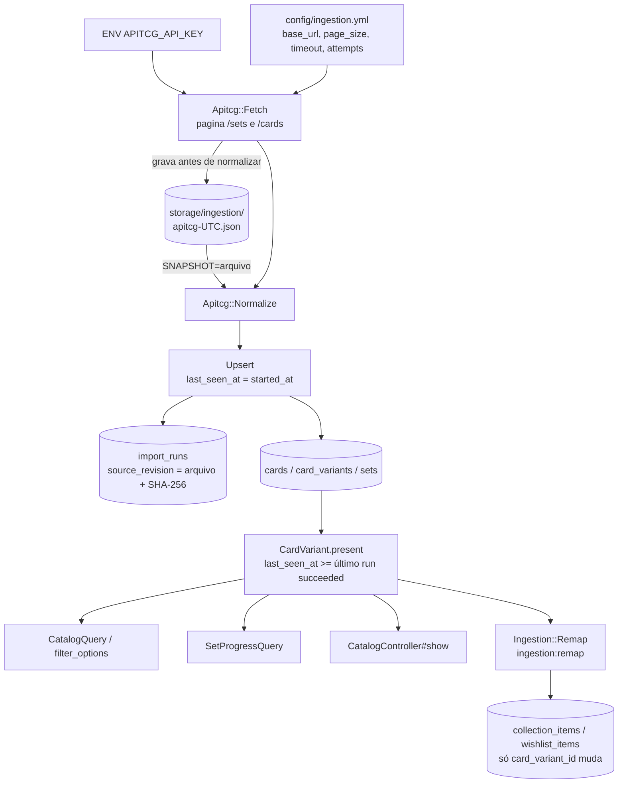

# Troca da fonte do catálogo para a apitcg — Design

**Spec**: `.specs/features/fonte-apitcg/spec.md`
**Status**: Approved (dono, 2026-09-30)

Conforma com AD-002 (Rails + PostgreSQL), AD-003 (parallels em métrica
separada), AD-005 (`.context/` vence) e AD-012 (imagem servida pelo app com
restrição de host). Aplica a AD-019, que supersede a AD-001.

---

## Architecture Overview

O pipeline Fetch → Normalize → Upsert continua o mesmo. Trocar de fonte
significa reescrever Fetch e Normalize, como o design original previa. O Upsert
só muda na contagem dos descartes (SRC-11). O que muda no lado de leitura
decorre de uma regra só, a **presença na fonte**, e ela vive num único scope.

---

## Code Reuse Analysis

### Existing Components to Leverage

| Component | Location | How to Use |
|---|---|---|
| `Ingestion::Upsert` | `app/services/ingestion/upsert.rb:15-107` | Reusado. Consome os mesmos `Normalized*` structs; só ganha o descarte fora de `failed_count` |
| Structs `NormalizedSet/Card/Variant` | `app/services/ingestion/normalize.rb:27-37` | Continuam sendo o contrato Normalize → Upsert. Saem para um arquivo próprio, porque o normalizador da optcgjson é removido |
| Escrita atômica do payload | `app/services/ingestion/fetch.rb:67-74` (`.part` + `rename`) | Mesmo padrão para o snapshot |
| Cliente HTTP injetável | `fetch.rb:11-20`, `fetch_test.rb:81-87` | Mesmo padrão de fake injetado; o cliente ganha headers e timeout configurável. Sem WebMock |
| `last_seen_at` | `upsert.rb:77,93` | É a base da presença; nenhuma coluna nova |
| `Row#completion_percent` com teto de 100% | `app/queries/set_progress_query.rb:139-150` | Mantido; mudam os agregados |
| Relatório no rake | `lib/tasks/ingestion.rake:3` | Mesmo estilo para `ingestion:remap` e `ingestion:compare_snapshots` |

### Integration Points

| System | Integration Method |
|---|---|
| apitcg | `GET /api/one-piece/sets` e `GET /api/one-piece/cards?page=N&limit=100`, header `x-api-key` |
| `CatalogQuery` | Escopo base passa de `Card.all` para cartas com variante presente; filtros de set e raridade (`catalog_query.rb:345-358`) passam a olhar só variantes presentes |
| `CatalogQuery.filter_options` | `catalog_query.rb:157-178` passa a partir de variantes presentes |
| Detalhe da carta | `catalog_controller.rb:40-45`: variantes presentes mais as ausentes que o usuário tem |
| `CardImageCache` | `ALLOWED_HOST` (`card_image_cache.rb:30`) e `VARIANT_CODE_FORMAT` (`:31`) |

---

## Components

### `Ingestion::SourceConfig` (reescrito)

- **Purpose**: ler a configuração da apitcg e a chave, e abortar antes da rede quando a chave falta.
- **Location**: `app/services/ingestion/source_config.rb`, `config/ingestion.yml`
- **Interfaces**:
  - `self.load(path = config/ingestion.yml, env: ENV) -> SourceConfig`
  - `#source -> "apitcg"`, `#base_url`, `#page_size (100)`, `#timeout (30)`, `#attempts (3)`
  - `#api_key`: levanta `MissingApiKey` ("APITCG_API_KEY não configurada") se ausente ou vazia (SRC-02)
  - `#inspect` / `#to_s` não expõem a chave (SRC-05)
- **Reuses**: o `MissingSetting` atual. As regras de revisão imutável (`MOVING_REFERENCES`, `COMMIT_SHA`, `TAG`) saem, porque o Req. 1.9 emendado não tem mais revisão.

### `Ingestion::Apitcg::Fetch`

- **Purpose**: buscar `/sets` e todas as páginas de `/cards`, e gravar o snapshot antes de qualquer normalização.
- **Location**: `app/services/ingestion/apitcg/fetch.rb`
- **Interfaces**:
  - `initialize(config:, storage_dir:, http: NetHttpClient.new(timeout: config.timeout), clock: Time, sleeper: ->(s) { sleep(s) })`
  - `#call -> Result(path, sha256, byte_size)`
- **Behavior**:
  - As páginas são buscadas em sequência, sem paralelismo, por causa do limite de requisições (`⚠️ VERIFICAR`).
  - Cada requisição tem até `attempts` tentativas. A espera é de 2s e depois 4s, via `sleeper` injetável. Timeout e não-2xx contam como falha. Um 401 levanta `KeyRejected` na hora, sem repetir (SRC-32). Esgotadas as tentativas, levanta `SourceUnavailable` (SRC-04).
  - A paginação para quando a página volta vazia ou `page >= totalPages`. Os produtos são deduplicados por `_id` antes da gravação (SRC-33).
  - O snapshot é `{"fetched_at": ISO8601, "sets": [...], "cards": [...]}`, gravado com `.part` + `rename`. A chave nunca entra: o corpo gravado são só as respostas, nunca os headers (SRC-05).
  - O nome do arquivo é `apitcg-<UTC YYYYMMDDTHHMMSSZ>.json`. Se o arquivo já existir, a busca falha em vez de sobrescrevê-lo (Req. 1.11).
- **Dependencies**: `SourceConfig`, `Net::HTTP`.

### `Ingestion::Apitcg::Normalize`

- **Purpose**: o único lugar que conhece o formato da apitcg. Traduz o snapshot para os structs `Normalized*`.
- **Location**: `app/services/ingestion/apitcg/normalize.rb`
- **Interfaces**: `self.call(snapshot_hash) -> Result(sets, cards, variants, discarded)`
- **Behavior**, pela ordem de aplicação:
  1. Filtra `type = card`. `CardType = DON!!` é descartado em silêncio (SRC-10). Produto sem `code` vai para `discarded` com o `_id` (SRC-11).
  2. `variant_code` recebe `"tcgplayer:#{markets.tcgplayer.id}"`, ou `"apitcg:#{_id}"` quando não há esse id (SRC-09). A mesma variante em dois sets fica no primeiro em que aparece (SRC-34).
  3. **Código do set**, em duas passadas (SRC-14):
     - Primeira passada: normaliza os `code` presentes (remove o hífen entre letras e dígitos, troca espaço por hífen).
     - Segunda passada, para os sets de `code` nulo: usa o prefixo de maioria estrita, se ele não colidir com um código já usado; senão, o slug sem `one-piece-`.
     - `released_on` vem de `release_date`.
  4. `art_kind` sai do último sufixo entre parênteses, pela tabela de Assumptions (SRC-13). Set de promoção vira `promo`.
  5. A impressão que define a carta é a `base` do set de estreia. Sem ela, a do set com `released_on` mais recente; empate pelo menor `variant_code` (SRC-12). O set de estreia vira o `set_id` da carta.
  6. Limpeza de texto: remove tags, converte ` ` em `\n`, remove disclaimers e links de errata. O trecho após `[Trigger]` vai para `trigger_text` e sai do efeito. `block_icon` fica nil.
  7. `base_set_size` pela regra de SRC-24/SRC-35, calculada sobre os `card_number` distintos do set após os descartes. `total_set_size` é o número de variantes do set.
  8. `card_type` e `traits` usam os mapeamentos atuais (`CARD_TYPES`, deduplicação case-insensitive). `attributes.Subtypes` vem como string `"A;B"` e é quebrada em `;`.
  9. `image_url` recebe a imagem `large` (`images` pode vir como objeto ou como array; `⚠️ VERIFICAR` no snapshot qual forma vale).

### `Ingestion::Upsert` (ajuste)

- `#call` passa a receber `discarded`. Eles entram em `error_log` com `"error" => "discarded"`, não contam em `failed_count` e não mudam o status (SRC-11).
- `source_revision` recebe `"#{File.basename(path)} sha256:#{hex}"` (SRC-06).
- A execução que falha na busca (SRC-04, SRC-32) também gera um `ImportRun`: `status: failed`, `source_revision: "(busca não concluída)"` e o erro no `error_log`, sem nenhuma escrita em catálogo. Assim o status `failed` fica visível no banco, como o Req. 1.6 pede.

### `Ingestion::Run` e `ingestion:import` (ajuste)

- `Run.call(snapshot: nil)`: sem `snapshot`, faz Fetch → Normalize → Upsert. Com `snapshot`, lê o arquivo e **não constrói** o `Fetch`, logo não abre socket nem lê a chave (SRC-07, Req. 11.5).
- O rake lê `SNAPSHOT=`. O `REUSE_PAYLOAD=1` sai, porque ficou redundante.

### `CardVariant.present` / `Card.present` / `CardSet.present`

- **Purpose**: a definição única de "presente na fonte" (SRC-16).
- **Location**: `app/models/card_variant.rb`, `card.rb`, `card_set.rb`
- **Interfaces**:
  - `CardVariant.present` → `where("card_variants.last_seen_at >= (SELECT max(started_at) FROM import_runs WHERE status = 'succeeded')")`. Sem nenhum run `succeeded`, a subconsulta dá NULL e nada é presente.
  - `Card.present` / `CardSet.present` → `where(id: CardVariant.present.select(:card_id / :set_id))`.
- **Consumers**: `CatalogQuery` (escopo base, filtros de set e raridade, EXISTS de posse), `filter_options`, `CatalogController#index` (preload das variantes do tile) e `#show`, `SetProgressQuery`, `Remap`.

### Detalhe da carta (SRC-17)

- `CatalogController#show`: carrega as variantes presentes da carta e, com usuário na sessão, soma as ausentes que ele tem na coleção ou na wishlist. `authenticated?` é chamado antes, pela armadilha documentada no `CLAUDE.md`. A ordem continua por `variant_code`.
- A view marca a variante ausente com o texto visível "fora da fonte" ao lado da linha de raridade (`show.html.erb:234`). O rótulo é texto, não só cor.
- Os rótulos de `art_kind` (`show.html.erb:204`) já cobrem `alternate_art`, `manga` e `promo`; só é preciso conferir.

### `SetProgressQuery` (reescrita dos agregados)

- **Purpose**: progresso por **números de carta distintos** (SRC-24..28).
- **Location**: `app/queries/set_progress_query.rb:214-231`
- **Behavior**:
  - Só entram sets presentes e variantes presentes.
  - O denominador continua `sets.base_set_size`.
  - O universo do numerador sai do próprio valor gravado. Se `base_set_size` for igual ao número de `card_number` distintos presentes no set, o universo é o set inteiro; senão, só os números cujo prefixo é o código do set. Assim a regra de SRC-24 não é reimplementada em SQL: o valor gravado já diz qual ramo ela tomou.
  - O numerador é `COUNT(DISTINCT cards.card_number)` do universo com ao menos uma variante presente do set, possuída e com `art_kind <> 'parallel'`. Duas impressões do mesmo número contam uma vez (SRC-28). Isso também inclui `alternate_art`, `manga` e `promo`, que antes caíam fora do numerador.
  - O teto de 100% em `completion_percent` continua (SRC-26). A contagem de parallels continua separada (SRC-27).

### `Ingestion::Remap` e `ingestion:remap`

- **Purpose**: apontar coleção e wishlist para as variantes novas (SRC-19..23).
- **Location**: `app/services/ingestion/remap.rb`, `lib/tasks/ingestion.rake`
- **Interfaces**: `Remap.call -> Report(moved: [...], skipped: [{card_number, old_variant_code, reason}])`
- **Behavior**:
  1. Sem nenhum run `succeeded`, levanta `NoSucceededRun` com a mensagem de SRC-23.
  2. Para cada item (coleção e wishlist, em conjuntos separados) cuja variante não está presente, calcula os candidatos: variantes presentes da mesma `card_id`, do mesmo `sets.code` e da mesma classe de arte (`art_kind = 'base'` casa com `'base'`; `<> 'base'` casa com `<> 'base'`).
  3. Classifica: 0 candidatos é "sem candidato"; mais de 1, "ambíguo". Quando mais de um item do mesmo usuário cai no mesmo candidato, ou quando o usuário já tem item nele, é "colisão" para todos os envolvidos.
  4. Aplica todos os movimentos numa **única transação**: `update_columns(card_variant_id:)`, sem tocar `quantity` nem `target_quantity` (SRC-20). Se algo falhar, nada se move. O índice único `(user_id, card_variant_id)` é a última barreira contra uma colisão não detectada.
  5. Idempotente por construção: o item movido aponta para uma variante presente e sai do universo da passada seguinte (SRC-22).
- O rake imprime o total movido e uma linha por item pulado. O relatório só leva `card_number`, `variant_code` e motivo, nada do usuário.

### `ingestion:compare_snapshots` (SRC-31)

- `Ingestion::Apitcg::CompareSnapshots.call(a_path, b_path) -> {common:, changed: [...]}`. Cruza por `_id` e conta os `markets.tcgplayer.id` diferentes. Não toca o banco nem a rede.

### `CardImageCache` (ajuste)

- `ALLOWED_HOST = "tcgplayer-cdn.tcgplayer.com"`.
- `VARIANT_CODE_FORMAT` passa a aceitar também `\A(tcgplayer|apitcg):[A-Za-z0-9]+\z`. O formato antigo continua aceito, porque as variantes da optcgjson seguem no banco e o cache delas fica em disco.
- O nome do arquivo em cache troca `:` por `-`, e o teste de path traversal (`:96`) é refeito sobre o nome saneado.
- A extensão da imagem `large` do tcgplayer é `⚠️ VERIFICAR` no snapshot. Se não vier `.jpg`/`.png`/`.webp`, a lista de extensões precisa de emenda.

### Fixture e `verify_fixture.py`

- `spec/fixtures/apitcg-subset.json` é recortado de um snapshot real, no mesmo formato `{fetched_at, sets, cards}`. Contém cada caso de SRC-29, e o recorte é feito por script no scratchpad.
- `spec/verify_fixture.py` é reescrito para a forma nova, com uma verificação por caso de SRC-29, mantendo as verificações atuais que ainda fazem sentido: `counter` nulo ≠ 0, só líder tem `life`, líder sem custo, multicor e mais de um atributo.
- `optcgjson-subset.json` sai do repositório junto com o normalizador que o consumia. Os testes que editam o payload com nomes de campo da optcgjson (`normalize_test.rb:88`, `guarantees_test.rb:330-340`, `upsert_test.rb:19`) passam a usar os da apitcg.

---

## Data Models

Nenhuma coluna nova. A única migração possível é de índice
(`import_runs(status, started_at)`, `card_variants(last_seen_at)`), e só entra
se o plano de execução da task de catálogo mostrar que precisa. Todas as
colunas necessárias já existem:
`sets.released_on`, `sets.base_set_size`, `card_variants.art_kind` (o CHECK já
admite os seis valores), `last_seen_at` em cartas e variantes, `import_runs.error_log`.

| Invariante | Onde é garantida |
|---|---|
| Coleção nunca apagada na troca | Ingestão sem delete; FKs `RESTRICT` (`structure.sql:776,800`) |
| Um item por usuário e variante | UNIQUE `(user_id, card_variant_id)` (`:710,752`) + detecção de colisão no Remap |
| Presença sem coluna nova | `CardVariant.present` sobre `last_seen_at` e `import_runs` |

---

## Error Handling Strategy

| Error Scenario | Handling | User Impact |
|---|---|---|
| Chave ausente | `MissingApiKey` antes da rede e do banco | Rake sai 1 com "APITCG_API_KEY não configurada" |
| 401 | `KeyRejected`, sem repetição, `ImportRun` failed | "chave da apitcg recusada (401)" |
| Timeout / 5xx / 404 | 3 tentativas com espera; depois `ImportRun` failed, catálogo intacto | Mensagem com a página que falhou, sem a chave |
| Produto sem `code` | Descarte em `error_log`, fora de `failed_count` | Nenhum; run pode terminar `succeeded` |
| Erro num registro | Transação própria, `error_log`, run `failed` (comportamento atual) | Presença não avança; catálogo continua no run anterior |
| Remap sem run `succeeded` | `NoSucceededRun` | Mensagem de SRC-23 |
| Remap com falha no meio | Transação única, rollback | Nenhum item movido; rodar de novo |

---

## Risks & Concerns

| Concern | Location | Impact | Mitigation |
|---|---|---|---|
| Não existe snapshot real da apitcg; a API respondeu 500/404 na última tentativa | `storage/ingestion/` | Sem fixture, nenhum teste de Normalize é escrito contra dados reais | A captura é a T1 e bloqueia a fase de ingestão. Presença, remapeamento, progresso e imagem não dependem dela e podem andar antes |
| O primeiro run apitcg que termine `failed` mantém a presença no run da optcgjson | `CardVariant.present` | O catálogo continua mostrando a optcgjson | É o comportamento desejado (run incompleto não publica). Os casos conhecidos (sem `code`, `DON!!`) já são descarte |
| Subconsulta de presença em toda consulta do catálogo | `CatalogQuery`, `SetProgressQuery` | Risco para o p95 < 500ms (Req. 11.1) | `max(started_at)` com índice em `import_runs(status, started_at)` e em `card_variants(last_seen_at)`; plano conferido na task de catálogo. Se não bastar, a saída é índice, não coluna |
| `CardImagesController` busca por `variant_code` globalmente, mas a unicidade é por carta | `card_images_controller.rb:16-40` | Com duas fontes, um código ambíguo servia a imagem errada | Os formatos antigo e novo não colidem (`:` só no novo), e o `tcgplayer.id` é distinto nos 7.247 produtos. Fica registrado, sem task |
| Estabilidade do `tcgplayer.id` | SRC-31 | Idempotência e vínculo da coleção | `compare_snapshots` sobre dois snapshots com 24h ou mais de diferença, antes de fechar a feature |
| Rodar `ingestion:remap` antes de um run apitcg `succeeded` | Remap | Variantes da optcgjson ainda presentes: nenhum item é elegível | SRC-23 cobre a ausência total de run; com o run antigo `succeeded`, o remap não move nada, sem dano |
| Churn grande de testes fixados na optcgjson | `test/services/ingestion/*` | Muitos testes a reescrever na mesma task do normalizador | Normalize e seus testes numa task; Upsert/guarantees em outra, as duas sobre a fixture nova |
| Dados do usuário escritos pelo Remap | `collection_items`, `wishlist_items` | Mover para a variante errada é irreversível na prática | Classe de arte conservadora (SRC-19 emendado), transação única, relatório de pulados, índice único como barreira. Rodar primeiro sobre uma cópia do banco de dev |

---

## Tech Decisions

| Decision | Choice | Rationale |
|---|---|---|
| Normalizador | Novo em `Ingestion::Apitcg::`; o da optcgjson é removido | Troca completa (AD-019). Manter os dois seria código morto com teste próprio |
| Presença | Scope sobre `last_seen_at` e o último run `succeeded` | Aceito no spec ("sem coluna nova"). Alternativa rejeitada: coluna booleana atualizada no fim do run, que duplica estado e precisa de backfill |
| Universo do numerador no progresso | Deduzido de `base_set_size` gravado vs. números distintos presentes | Evita reimplementar a regra de maioria em SQL |
| Transação do Remap | Uma única para todos os itens | Dado insubstituível: tudo ou nada, e rodar de novo é seguro |
| Falha na busca | Gera `ImportRun` failed | Req. 1.6 pede o status registrado; o Fetch atual falha sem registro |
| Espera entre tentativas | 2s, 4s | "Espera crescente" do spec; valor escolhido, injetável para teste |
