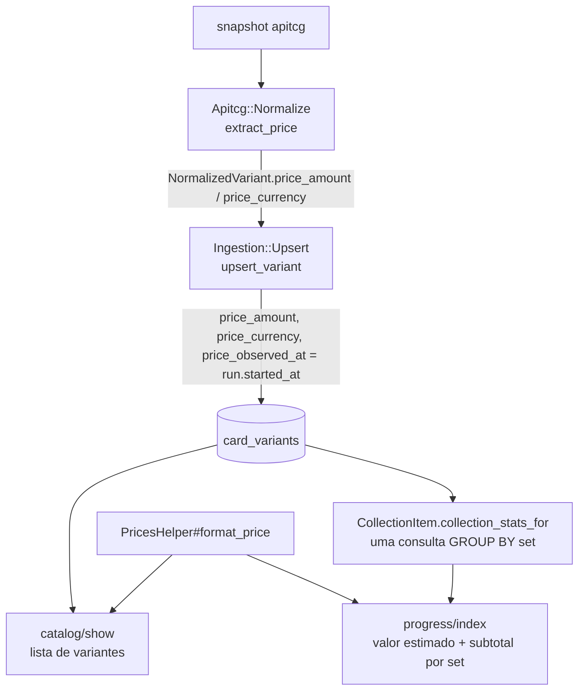

# Preços — Design

**Spec**: `.specs/features/precos/spec.md`
**Status**: Draft

---

## Architecture Overview

O preço entra pelo caminho que o catálogo já usa e sai por duas leituras que já
existem. Não há componente novo de infraestrutura, consulta nova na pasta nem
chamada à apitcg fora da ingestão.



---

## Code Reuse Analysis

### Existing Components to Leverage

| Component | Location | How to Use |
|---|---|---|
| `Apitcg::Normalize#normalize_variant` | `app/services/ingestion/apitcg/normalize.rb:223` | Ganha `price_amount` e `price_currency` no `NormalizedVariant`; o formato `markets.tcgplayer.prices.market` fica só aqui (PRC-06) |
| `Ingestion::Upsert#upsert_variant` | `app/services/ingestion/upsert.rb` (`upsert_variant`) | Grava os três campos de preço no mesmo `update!`; a data é `@started_at`, o mesmo instante que vira `last_seen_at` |
| Ausência marcada, nunca apagada | `Upsert#finish` só toca variantes vistas | PRC-04 sai de graça: variante fora do snapshot não passa por `upsert_variant`, logo o preço dela não muda |
| `clock:` do `Upsert` | `upsert.rb` (`initialize`) | Testes fixam `price_observed_at` sem depender do relógio do WSL2 (AD-009) |
| `CollectionItem.collection_stats_for` | `app/models/collection_item.rb:74` | Vira a consulta de valor: mesma consulta dos indicadores, agrupada por `card_variants.set_id`; total, cópias, distintas e valor saem da soma das linhas |
| `CollectionItem.for_user(...).owned` | `app/models/collection_item.rb` | Isolamento por usuário (PRC-14) já garantido, incluindo a recusa de id no lugar de `User` |
| Bloco `.progress__summary` | `app/views/progress/index.html.erb:90` | O valor estimado entra como terceiro `.progress__stat` |
| `.variant__meta` | `app/views/catalog/show.html.erb` (~258) | O preço entra como mais um par `dt`/`dd` na lista de variantes |
| Fixture `spec/fixtures/apitcg-subset.json` | — | Já traz `markets.tcgplayer.prices`; primeiro produto `541058` com `market: 1.7` |

### Integration Points

| System | Integration Method |
|---|---|
| PostgreSQL | Migração em `card_variants` com três colunas e duas `CHECK`; `schema_format :sql` exige `db:migrate` para regenerar `db/structure.sql` |
| Teste protegido da pasta | `test/queries/set_progress_plan_test.rb` continua com 3 consultas (AD-021): a consulta de valor **substitui** a dos indicadores, não se soma a ela |
| `spec/verify_fixture.py` | Sem mudança: a fixture não muda, e as 19 verificações continuam passando |

---

## Components

### Colunas de preço em `card_variants`

- **Purpose**: guardar o preço atual da variante com moeda e data, sem estado parcial.
- **Location**: `db/migrate/20261005120000_add_price_to_card_variants.rb`, `db/structure.sql`, `app/models/card_variant.rb`
- **Interfaces**:
  - `price_amount: numeric(10,2) NULL`, `price_currency: text NULL`, `price_observed_at: timestamp NULL`
  - `CHECK ((price_amount IS NULL) = (price_currency IS NULL) AND (price_amount IS NULL) = (price_observed_at IS NULL))` (PRC-05)
  - `CHECK (price_amount >= 0)` (PRC-05)
  - `CardVariant#priced?` → `!price_amount.nil?`
- **Dependencies**: nenhuma.
- **Reuses**: o padrão de `CHECK` no banco de `card_variants_art_kind_check`.

### `Apitcg::Normalize#extract_price`

- **Purpose**: traduzir `markets.tcgplayer.prices.market` em `(amount, currency)` ou nada.
- **Location**: `app/services/ingestion/apitcg/normalize.rb`
- **Interfaces**:
  - `NormalizedVariant` ganha `price_amount` (`BigDecimal` ou `nil`) e `price_currency` (`"USD"` ou `nil`)
  - `extract_price(product)` → `[BigDecimal, "USD"]` quando `market` é `Integer` ou `Float` finito e `>= 0`; `[nil, nil]` em qualquer outro caso, string incluída (PRC-02, edge case)
- **Dependencies**: nenhuma.
- **Reuses**: lê só `prices`, nunca `printings` (PRC-03). `BigDecimal(value.to_s)` evita levar o erro binário do `Float` para o banco.

### `Ingestion::Upsert#upsert_variant`

- **Purpose**: gravar o preço normalizado com a data do import.
- **Location**: `app/services/ingestion/upsert.rb`
- **Interfaces**: o `update!` existente passa a incluir `price_amount`, `price_currency` e `price_observed_at: record.price_amount.nil? ? nil : @started_at`.
- **Dependencies**: `NormalizedVariant` com os campos novos.
- **Reuses**: transação por registro, contagem e `error_log` existentes. Preço inválido nunca chega aqui como erro: o Normalize já o converteu em `nil` (PRC-02).

### `PricesHelper#format_price` e `#price_label`

- **Purpose**: o único lugar que sabe escrever preço e rótulo.
- **Location**: `app/helpers/prices_helper.rb`
- **Interfaces**:
  - `format_price(amount, currency)` → `"US$ 1.234,56"`; `UNITS = { "USD" => "US$" }`. Moeda sem unidade conhecida cai no código ISO (`"BRL 1,00"`), sem quebrar a página.
  - `price_label(variant)` → `"TCGplayer · market · 05/10/2026"`, com a data em `America/Sao_Paulo`.
- **Dependencies**: `number_to_currency` do Rails (`unit:`, `separator: ","`, `delimiter: "."`, `format: "%u %n"`).
- **Reuses**: os helpers do Rails são incluídos em todas as views.

### Valor da coleção em `CollectionItem.collection_stats_for`

- **Purpose**: total, cópias sem preço e subtotal por set numa consulta.
- **Location**: `app/models/collection_item.rb`
- **Interfaces**: `collection_stats_for(user)` mantém `total_copies` e `distinct_variants` e ganha:
  - `estimated_value` (`BigDecimal`, `0` sem cópia com preço; PRC-11, PRC-15)
  - `unpriced_copies` (`Integer`; PRC-12)
  - `value_by_set_id` (`Hash{Integer => BigDecimal}`; PRC-13)
  - SQL: `SELECT card_variants.set_id, SUM(quantity), COUNT(*), SUM(quantity * price_amount) FILTER (WHERE price_currency = 'USD'), SUM(quantity) FILTER (WHERE price_amount IS NULL) ... GROUP BY card_variants.set_id`. O total é a soma das linhas, então a soma dos subtotais é igual ao total por construção, cópias de variante ausente incluídas.
- **Dependencies**: colunas de preço.
- **Reuses**: `for_user(user).owned` (PRC-14).

### Telas

- **Detalhe** (`app/views/catalog/show.html.erb`): em cada variante, `dt` "Preço" e `dd` com `format_price` e `price_label`, ou "Sem preço" (PRC-08, PRC-09). A página continua pública e o preço está na própria linha de `@variants`, sem consulta nova (PRC-10).
- **Pasta** (`app/views/progress/index.html.erb`): terceiro `.progress__stat` com o valor e o rótulo "valor estimado"; "N cópias sem preço" abaixo quando `unpriced_copies > 0` (PRC-11, PRC-12, PRC-15). Em cada `.progress-set`, o subtotal `stats[:value_by_set_id].fetch(row.set_id, 0)` (PRC-13).

---

## Data Models

```ruby
# card_variants (colunas novas)
price_amount      numeric(10,2) NULL   # máx. medido 13000, 2 casas no snapshot
price_currency    text NULL            # "USD"; ISO 4217
price_observed_at timestamp NULL       # import_runs.started_at do import que leu o preço
```

**Relationships**: o preço é atributo da `card_variant` (`design.md` §10). A coleção referencia a variante, então valor = `collection_items.quantity × card_variants.price_amount`.

---

## Error Handling Strategy

| Error Scenario | Handling | User Impact |
|---|---|---|
| `market` ausente, nulo, string, negativo ou não finito | Normalize devolve `nil`; o Upsert grava os três campos nulos | Variante mostra "Sem preço"; o import não falha |
| Variante ausente do snapshot | Não passa pelo Upsert; o preço fica como estava | Preço antigo com a data dele |
| Escrita parcial (bug futuro grava valor sem data) | A `CHECK` do banco recusa; o registro vai para `error_log` pelo `apply` existente | O import marca `failed` em vez de gravar estado inconsistente |
| Moeda diferente de USD no futuro | A soma da pasta só considera `USD` | Até existir conversão, essa cópia não entra no total |

---

## Risks & Concerns

| Concern | Location (file:line) | Impact | Mitigation |
|---|---|---|---|
| A pasta tem contagem de consultas protegida | `test/queries/set_progress_plan_test.rb:190` (AD-021) | Uma consulta de valor separada quebraria o teste e exigiria uma nova AD | A consulta de valor substitui a dos indicadores; continua com 3 |
| `SetProgressQuery` só vê variantes presentes | `app/queries/set_progress_query.rb` (`variants_join`, `PRESENT_SQL`) | Calcular o subtotal ali deixaria a soma dos subtotais menor que o total quando houver cópia de variante ausente | O subtotal sai de `collection_stats_for`, que não filtra presença. Um set sem nenhuma variante presente não tem linha na pasta, mas o valor dele continua no total (hoje: 0 cópias em variante ausente no banco de dev) |
| Fuso da data | `config/application.rb:33` (`time_zone` padrão, UTC) | Um import às 23h em Brasília mostraria a data do dia seguinte | `price_label` converte para `America/Sao_Paulo`, sem mudar o fuso do app inteiro |
| Arredondamento | — | Somar `Float` acumularia erro binário no total | `BigDecimal` no Normalize e `numeric` no banco; o total é somado no SQL e só formatado na view |
| Testes de ingestão comparam atributos de variante | `test/services/ingestion/` | Campos novos podem quebrar asserções de igualdade de struct | Os testes que montam `NormalizedVariant` à mão ganham os campos por `keyword_init` com padrão `nil` |
| Largura da pasta e do detalhe a 360px | Req. 2.5, `catalog.css` | `US$ 13.000,00` num stat estreito pode forçar scroll horizontal | O valor usa o mesmo `.progress__stat-value`; a task da pasta roda o guarda de 360px existente e a captura da AD-015 |

---

## Tech Decisions

| Decision | Choice | Rationale |
|---|---|---|
| Onde guardar o preço | Colunas em `card_variants`, sem tabela própria | Só o preço atual (decisão do dono); uma tabela 1:1 seria um join a mais sem ganho |
| Valor e moeda juntos | `numeric(10,2)` + `text` ISO 4217, com `CHECK` tudo-ou-nada | Convenção para o projeto inteiro: **AD-022** |
| Data do preço | `import_runs.started_at` do import | É o mesmo instante do `last_seen_at`; a fonte não traz data do preço |
| Subtotal por set | Da consulta dos indicadores, agrupada por `set_id` da variante | Mantém a contagem da AD-021 e fecha a soma dos subtotais com o total |
| Formatação | `PricesHelper`, sem I18n de locale `pt-BR` | O app não tem locale pt-BR (`config/locales/en.yml` só); trocar o locale global mudaria outras saídas. O helper fixa separadores |
